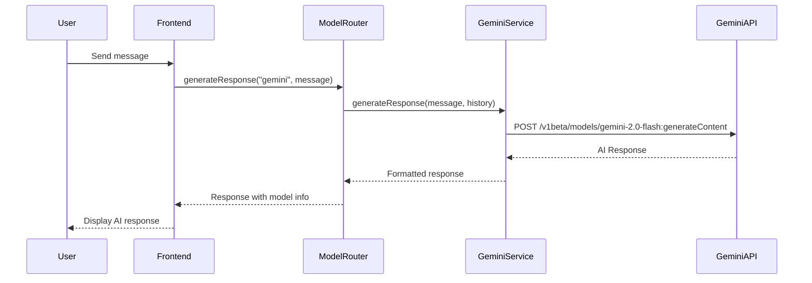

# 🤖 Google Gemini API Integration Guide

This comprehensive guide explains how Google Gemini AI is integrated into the ChatWithMe project, from setup to implementation.

---

## 📋 Table of Contents
1. [Overview](#overview)
2. [Prerequisites](#prerequisites)
3. [API Key Setup](#api-key-setup)
4. [Service Implementation](#service-implementation)
5. [Integration Flow](#integration-flow)
6. [Usage in Components](#usage-in-components)
7. [Error Handling](#error-handling)
8. [Testing](#testing)
9. [Troubleshooting](#troubleshooting)
10. [Advanced Configuration](#advanced-configuration)

---

## 1. Overview

Google Gemini is integrated as one of three AI models in this chatbot project:
- **Model**: `gemini-2.0-flash`
- **API**: Google's Generative Language API
- **Integration Pattern**: Service layer with fallback support
- **Features**: Conversation history, configurable parameters, error handling

### Architecture Flow


---

## 2. Prerequisites

### Required Dependencies
```json
{
  "dependencies": {
    "next": "15.4.4",
    "@types/node": "^20"
  }
}
```

### Environment Setup
- Node.js 18+ installed
- Next.js project initialized
- Google Cloud Project with Generative AI API enabled

---

## 3. API Key Setup

### Step 3.1: Create Google Cloud Project
1. Go to [Google Cloud Console](https://console.cloud.google.com/)
2. Create a new project or select existing one
3. Enable the **Generative Language API**:
   - Navigate to "APIs & Services" → "Library"
   - Search for "Generative Language API"
   - Click "Enable"

### Step 3.2: Generate API Key
1. Go to "APIs & Services" → "Credentials"
2. Click "Create Credentials" → "API Key"
3. Copy the generated API key
4. **Important**: Restrict the key to Generative Language API for security

### Step 3.3: Environment Configuration
Add to your `.env.local` file:
```env
# Google Gemini API
GEMINI_API_KEY=your_gemini_api_key_here
```

**Security Note**: Never commit API keys to version control. Use `.env.local` for development and environment variables in production.

---

## 4. Service Implementation

### Step 4.1: Create Gemini Service
Location: `src/services/geminiService.ts`

```typescript
import { ChatMessage } from '@/types/chat';

export class GeminiService {
  private static readonly API_URL = 'https://generativelanguage.googleapis.com/v1beta/models/gemini-2.0-flash:generateContent';
  
  // Check if API key is configured
  static isConfigured(): boolean {
    return !!process.env.GEMINI_API_KEY;
  }

  static async generateResponse(
    message: string, 
    conversationHistory: Array<{ role: string; content: string }> = []
  ): Promise<string> {
    if (!this.isConfigured()) {
      throw new Error('Gemini API key not configured');
    }

    try {
      // Convert conversation history to Gemini format
      const contents = conversationHistory.map(msg => ({
        role: msg.role === 'assistant' ? 'model' : 'user',
        parts: [{ text: msg.content }]
      }));

      // Add current message
      contents.push({
        role: 'user',
        parts: [{ text: message }]
      });

      const response = await fetch(`${this.API_URL}?key=${process.env.GEMINI_API_KEY}`, {
        method: 'POST',
        headers: {
          'Content-Type': 'application/json',
        },
        body: JSON.stringify({
          contents,
          generationConfig: {
            temperature: 0.7,        // Creativity level (0-1)
            topK: 40,               // Limits token selection
            topP: 0.95,             // Nucleus sampling threshold
            maxOutputTokens: 1024,   // Maximum response length
          },
        }),
      });

      if (!response.ok) {
        const errorData = await response.json().catch(() => ({}));
        throw new Error(`Gemini API error: ${response.status} - ${errorData.error?.message || 'Unknown error'}`);
      }

      const data = await response.json();
      
      if (!data.candidates || !data.candidates[0] || !data.candidates[0].content) {
        throw new Error('Invalid response format from Gemini API');
      }

      return data.candidates[0].content.parts[0].text;
    } catch (error) {
      console.error('Gemini API Error:', error);
      throw new Error(`Failed to generate Gemini response: ${error instanceof Error ? error.message : 'Unknown error'}`);
    }
  }
}
```

### Step 4.2: Key Implementation Details

#### API Endpoint
- **URL**: `https://generativelanguage.googleapis.com/v1beta/models/gemini-2.0-flash:generateContent`
- **Method**: POST
- **Authentication**: API key in query parameter

#### Request Format
```json
{
  "contents": [
    {
      "role": "user",
      "parts": [{ "text": "Your message here" }]
    }
  ],
  "generationConfig": {
    "temperature": 0.7,
    "topK": 40,
    "topP": 0.95,
    "maxOutputTokens": 1024
  }
}
```

#### Response Format
```json
{
  "candidates": [
    {
      "content": {
        "parts": [
          {
            "text": "AI response here"
          }
        ]
      }
    }
  ]
}
```

---

## 5. Integration Flow

### Step 5.1: Model Router Integration
Location: `src/services/modelRouterService.ts`

```typescript
import { GeminiService } from './geminiService';

export class ModelRouterService {
  static async generateResponse(
    model: ModelType,
    message: string,
    conversationHistory: Array<{ role: string; content: string }> = []
  ): Promise<{ response: string; model: ModelType }> {
    try {
      let response: string;

      switch (model) {
        case 'gemini':
          if (GeminiService.isConfigured()) {
            response = await GeminiService.generateResponse(message, conversationHistory);
          } else {
            console.log('Gemini not configured, using fallback');
            response = await this.generateFallbackResponse(message);
          }
          break;
        // ... other cases
      }

      return { response, model };
    } catch (error) {
      console.error(`${model} failed, using fallback:`, error);
      const fallbackResponse = await this.generateFallbackResponse(message);
      return { response: fallbackResponse, model };
    }
  }
}
```

### Step 5.2: API Route Integration
Location: `src/app/api/chat/route.ts`

```typescript
import { ModelRouterService, ModelType } from '@/services/modelRouterService';

export async function POST(request: NextRequest) {
  try {
    const { message, model = 'groq', conversationId } = await request.json();
    
    // Get conversation history if available
    let conversationHistory: any[] = [];
    if (conversationId && session?.user?.id) {
      conversationHistory = await DatabaseService.getConversationHistory(
        conversationId,
        session.user.id,
        10 // Last 10 messages for context
      );
    }

    // Generate AI response using selected model (including Gemini)
    const aiResult = await ModelRouterService.generateResponse(
      model as ModelType,
      message,
      conversationHistory
    );

    return NextResponse.json({
      userMessage: {
        id: uuidv4(),
        content: message,
        role: 'user',
        timestamp: new Date().toISOString(),
        conversationId: conversationId || null
      },
      aiMessage: {
        id: uuidv4(),
        content: aiResult.response,
        role: 'assistant',
        model: aiResult.model,
        timestamp: new Date().toISOString(),
        conversationId: conversationId || null
      }
    });
  } catch (error) {
    // Error handling
  }
}
```

---

## 6. Usage in Components

### Step 6.1: Model Selection
Location: `src/components/ModelSelector.tsx`

```typescript
const models = {
  gemini: {
    name: 'Google Gemini',
    description: 'Google\'s advanced AI model',
    isConfigured: true, // This will be checked dynamically
    icon: '💎'
  }
};
```

### Step 6.2: Chat Integration
Location: `src/components/SearchInput.tsx`

```typescript
const handleSubmit = async (e: React.FormEvent) => {
  e.preventDefault();
  if (!message.trim() || isLoading) return;

  try {
    const response = await fetch('/api/chat', {
      method: 'POST',
      headers: { 'Content-Type': 'application/json' },
      body: JSON.stringify({
        message: message.trim(),
        model: selectedModel, // Can be 'gemini'
        conversationId: currentChatId
      })
    });

    const data = await response.json();
    // Handle response
  } catch (error) {
    // Handle error
  }
};
```

---

## 7. Error Handling

### Common Error Scenarios

#### 7.1: API Key Not Configured
```typescript
// Error: "Gemini API key not configured"
// Solution: Add GEMINI_API_KEY to .env.local
```

#### 7.2: Invalid API Key
```typescript
// Error: "Gemini API error: 400 - API key not valid"
// Solution: Verify API key in Google Cloud Console
```

#### 7.3: Quota Exceeded
```typescript
// Error: "Gemini API error: 429 - Quota exceeded"
// Solution: Check usage limits in Google Cloud Console
```

#### 7.4: Content Policy Violation
```typescript
// Error: "Content filtered due to safety settings"
// Solution: Adjust safety settings or modify content
```

### Error Recovery Strategy
1. **Primary**: Try Gemini API
2. **Secondary**: Log error and use fallback response
3. **Tertiary**: Display user-friendly error message

---

## 8. Testing

### Step 8.1: Environment Test
```typescript
// Test if Gemini is properly configured
console.log('Gemini configured:', GeminiService.isConfigured());
```

### Step 8.2: API Test
```typescript
// Test basic functionality
const testMessage = "Hello, how are you?";
try {
  const response = await GeminiService.generateResponse(testMessage);
  console.log('Gemini response:', response);
} catch (error) {
  console.error('Gemini test failed:', error);
}
```

### Step 8.3: Integration Test
1. Start development server: `npm run dev`
2. Select "Google Gemini" model in the chat interface
3. Send a test message
4. Verify response is generated and displayed

---

## 9. Troubleshooting

### Issue: "API key not valid"
**Solutions:**
- Verify API key is correctly copied
- Ensure Generative Language API is enabled
- Check API key restrictions

### Issue: "Quota exceeded"
**Solutions:**
- Monitor usage in Google Cloud Console
- Upgrade billing plan if needed
- Implement rate limiting

### Issue: "Invalid response format"
**Solutions:**
- Check API endpoint URL
- Verify request payload format
- Update to latest API version

### Issue: Fallback always triggers
**Solutions:**
- Check environment variable name
- Restart development server
- Verify API key permissions

---

## 10. Advanced Configuration

### Step 10.1: Custom Generation Parameters
```typescript
generationConfig: {
  temperature: 0.9,      // Higher = more creative
  topK: 50,             // Higher = more diverse
  topP: 0.8,            // Lower = more focused
  maxOutputTokens: 2048, // Longer responses
  stopSequences: ["END"] // Custom stop words
}
```

### Step 10.2: Safety Settings
```typescript
safetySettings: [
  {
    category: "HARM_CATEGORY_HARASSMENT",
    threshold: "BLOCK_MEDIUM_AND_ABOVE"
  },
  {
    category: "HARM_CATEGORY_HATE_SPEECH",
    threshold: "BLOCK_MEDIUM_AND_ABOVE"
  }
]
```

### Step 10.3: System Instructions
```typescript
systemInstruction: {
  parts: [
    {
      text: "You are a helpful AI assistant. Be concise and accurate."
    }
  ]
}
```

---

## 🔗 Useful Links

- [Gemini API Documentation](https://ai.google.dev/docs)
- [Google Cloud Console](https://console.cloud.google.com/)
- [API Pricing](https://ai.google.dev/pricing)
- [Gemini Models Overview](https://ai.google.dev/models/gemini)

---

## ✅ Checklist

- [ ] Google Cloud project created
- [ ] Generative Language API enabled
- [ ] API key generated and restricted
- [ ] Environment variable configured
- [ ] Service implementation complete
- [ ] Integration tested
- [ ] Error handling verified
- [ ] Fallback system working

---

**Need Help?** Check the troubleshooting section or refer to the [official documentation](https://ai.google.dev/docs).
