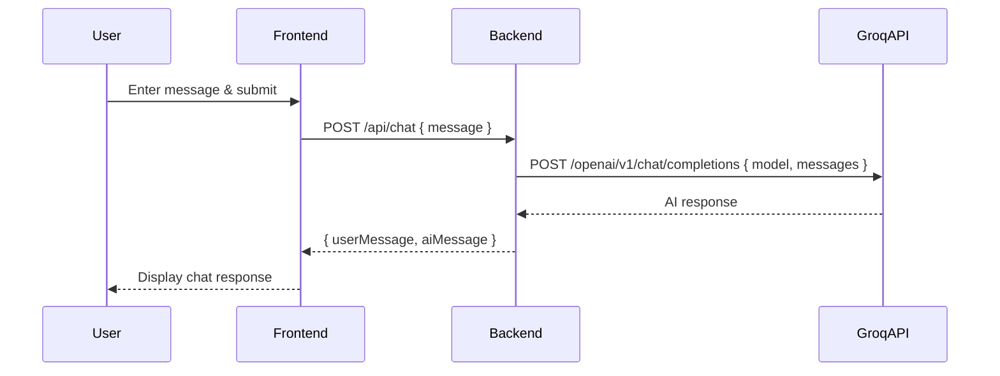

# Groq API Integration Guide

This README explains how Groq API is integrated into this Next.js chatbot project, how requests and responses are processed, and provides a code walkthrough and flow diagram.

---

## 1. Overview
This project uses Groq's LLM API to generate AI-powered chat responses. The integration is handled server-side via an API route, with frontend components for user interaction.

---

## 2. Environment Setup
- Add your Groq API key to `.env.local`:
  ```
  GROQ_API_KEY=your-groq-api-key-here
  ```
- The backend reads this key to authenticate requests to Groq.

---

## 3. Request/Response Flow



---

## 4. Key Files & Code Walkthrough

### Backend: `src/app/api/chat/route.ts`
- Handles POST requests from the frontend.
- Authenticates user, parses message, and calls `GroqService.generateResponse()`.
- Returns both user and AI messages to the frontend.

### Service: `src/services/groqService.ts`
- Prepares the request payload for Groq API.
- Uses the model `meta-llama/llama-4-scout-17b-16e-instruct`.
- Sends a POST request to Groq's endpoint with the user's message and recent chat history.
- Handles errors and returns the AI's response.

```typescript
// ...existing code...
const response = await axios.post(
  'https://api.groq.com/openai/v1/chat/completions',
  {
    model: 'meta-llama/llama-4-scout-17b-16e-instruct',
    messages,
    max_tokens: 1000,
    temperature: 0.7
  },
  {
    headers: {
      'Authorization': `Bearer ${apiKey}`
    }
  }
);
// ...existing code...
```

### Frontend: `src/components/SearchInput.tsx`, `src/components/Responses.tsx`, `src/contexts/ChatContext.tsx`
- User types a message and submits via `SearchInput`.
- Message is sent to `/api/chat` and state is updated with the response.
- `Responses` component displays the chat history.

---

## 5. Error Handling
- If Groq API fails or returns an error, a fallback response is generated server-side.
- Errors are shown in the UI for user awareness.

---

## 6. Customization
- You can change the model in `groqService.ts` to any supported by Groq.
- System prompt and message history logic can be adjusted for different AI behaviors.

---

## 7. Useful Links
- [Groq API Docs](https://console.groq.com/docs)
- [Groq Playground](https://console.groq.com/playground)

---

**For further help, see the code comments or ask for specific examples!**
